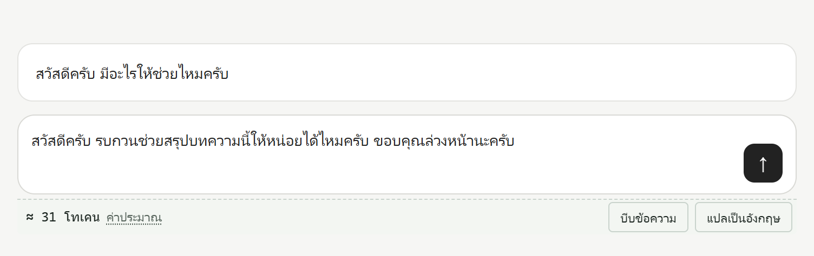
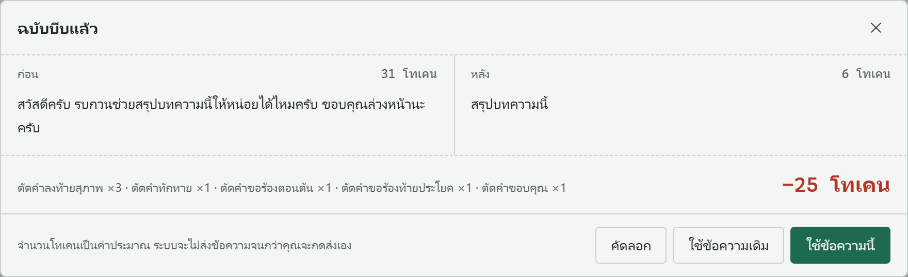

<p align="center"></p>

<h1 align="center">TadTingPai</h1>

<p align="center"><em>ตัดทิ้งไป</em><br>
ใช้โทเคนน้อยลงบน ChatGPT, Claude และ Gemini เวลาพิมพ์ภาษาไทย</p>

<p align="center">

[](https://github.com/TokenMaiPor/tad-ting-pai/actions/workflows/ci.yml)
[](https://github.com/TokenMaiPor/tad-ting-pai/releases/latest)
[](LICENSE)


</p>

<p align="center"><a href="README.md">English</a> · <strong>ภาษาไทย</strong></p>

> **v0.1 เป็นเวอร์ชันแรก** ใช้ได้กับทั้งสามเว็บแล้ว และอยากได้ความเห็นจากการใช้งานจริงมาก
> เจออะไรแปลกๆ [แจ้งใน Issues](https://github.com/TokenMaiPor/tad-ting-pai/issues/new/choose) ได้เลย แค่ประโยคเดียวก็ช่วยได้มาก

บริการแชท AI คิดเงินและจำกัดการใช้งานตาม **โทเคน** และตัวนับโทเคนส่วนใหญ่ถูกออกแบบมาเพื่อภาษาอังกฤษ
คำขอเดียวกันถ้าพิมพ์เป็นภาษาไทยมักใช้โทเคน **มากกว่า 2–3 เท่า** เราเรียกส่วนที่จ่ายเกินนี้ว่า _ภาษีโทเคน_

TadTingPai เป็นส่วนขยาย Chrome ฟรีและโอเพนซอร์ส ที่ช่วยลดภาษีโทเคนบน **ChatGPT**, **Claude** และ **Gemini**

- **นับโทเคนสด ๆ** ใต้ช่องพิมพ์แชท (เป็นค่าประมาณ อ่านหมายเหตุด้านล่าง)
- **บีบข้อความ**: ตัดคำลงท้ายสุภาพและคำฟุ่มเฟือยที่ AI ไม่จำเป็นต้องอ่าน
  (`ครับ` `ค่ะ` `นะคะ` `รบกวนช่วย…ให้หน่อยได้ไหม` `แบบว่า` …)
- **แปลเป็นอังกฤษ**: ใช้ตัวแปลของ Chrome ที่ **ทำงานในเครื่อง** และเติม "Reply in Thai." ต่อท้าย ให้ AI ยังตอบกลับเป็นภาษาไทย
- **คุณคุมเองทุกขั้น**: ทุกการเปลี่ยนแปลงจะแสดง **ข้อความก่อนและหลัง พร้อมจำนวนโทเคน**
  ไม่มีอะไรเปลี่ยนจนกว่าคุณจะกด **ใช้ข้อความนี้** และส่วนขยาย **ไม่ส่งข้อความให้เองเด็ดขาด** คุณกดส่งเองทุกครั้ง
- **ไม่แตะข้อความที่ต้องปกป้อง**: โค้ด, `โค้ดในบรรทัด`, ลิงก์, อีเมล, ตัวเลข และ "ข้อความในเครื่องหมายคำพูด"





> ตัวอย่าง: `สวัสดีครับ รบกวนช่วยสรุปบทความนี้ให้หน่อยได้ไหมครับ ขอบคุณล่วงหน้านะครับ` → `สรุปบทความนี้`
> ≈ 31 → 6 โทเคน (o200k_base) คุณเห็นตัวอย่างก่อนแล้วเลือกเอง ระบบไม่ส่งข้อความให้

## ความเป็นส่วนตัว

- **ไม่มีการเชื่อมต่อเครือข่าย** ไม่มีเซิร์ฟเวอร์ ไม่มีระบบวิเคราะห์ ไม่มีการเก็บสถิติการใช้งาน
  ESLint ห้ามใช้ `fetch`/`XMLHttpRequest`/`WebSocket` ในซอร์สโค้ด และ `npm run audit:network` ตรวจไฟล์ที่ build แล้วซ้ำใน CI
- **ขอสิทธิ์เดียวคือ `storage`** การตั้งค่าและยอด "โทเคนที่ประหยัดได้" เก็บใน `chrome.storage.local` บนเครื่องคุณ ไม่ซิงก์ไปที่ไหน
- ทำงานเฉพาะบน `chatgpt.com`, `chat.openai.com`, `claude.ai` และ `gemini.google.com`
- การแปลใช้ Translator API ที่มากับ Chrome ครั้งแรก Chrome อาจดาวน์โหลดโมเดลภาษาหนึ่งครั้ง หลังจากนั้นแปลในเครื่องทั้งหมด

## เรื่องตัวเลข (เป็นค่าประมาณ)

นับด้วยตัวนับ `o200k_base` ของ OpenAI (ตระกูล GPT-4o) ผ่าน [js-tiktoken](https://github.com/dqbd/tiktoken)
Claude และ Gemini ใช้ตัวนับของตัวเอง จึงควรดูตัวเลขเป็นแนวทางว่าประหยัด _มากน้อยแค่ไหน_ ไม่ใช่ยอดบิลจริง
ยอด "โทเคนที่ประหยัดได้" ในป็อปอัปนับเฉพาะตอนที่คุณกดใช้จริง และถ้าคำแปลยาวกว่าเดิมก็จะไม่ถูกนำไปหักจากยอด

## ติดตั้ง

### ติดตั้งแบบง่าย (ไม่ต้องเขียนโค้ด)

ต้องมี Chrome 120 ขึ้นไปบนคอมพิวเตอร์ (ปุ่มแปลต้องใช้ Chrome 138 ขึ้นไป)

1. ดาวน์โหลดไฟล์ `tad-ting-pai-<version>-chrome.zip` จาก [Release ล่าสุด](https://github.com/TokenMaiPor/tad-ting-pai/releases/latest) แล้วแตกไฟล์
2. เปิด `chrome://extensions` เปิด Developer mode มุมขวาบน
3. กด Load unpacked แล้วเลือกโฟลเดอร์ที่แตกไฟล์ออกมา (โฟลเดอร์ที่มีไฟล์ `manifest.json`)
4. กดไอคอนจิ๊กซอว์ แล้วปักหมุด TadTingPai ไว้บนแถบ

### ติดตั้งจากซอร์สโค้ด (สำหรับนักพัฒนา)

ต้องมี Node.js 22 ขึ้นไป

1. ในโฟลเดอร์โปรเจกต์ รัน `npm install` (ครั้งแรกเท่านั้น) แล้วรัน `npm run build`
2. เปิด `chrome://extensions` เปิด Developer mode มุมขวาบน
3. กด Load unpacked แล้วเลือกโฟลเดอร์ `.output/chrome-mv3`
4. กดไอคอนจิ๊กซอว์ แล้วปักหมุด TadTingPai ไว้บนแถบ

## วิธีใช้

1. เปิด [chatgpt.com](https://chatgpt.com), [claude.ai](https://claude.ai) หรือ [gemini.google.com](https://gemini.google.com) แล้วล็อกอินตามปกติ
2. ใต้ช่องพิมพ์แชทจะมีแถบบางๆ แสดง **≈ N โทเคน · ค่าประมาณ** ปุ่ม **บีบข้อความ** และปุ่ม **แปลเป็นอังกฤษ**
   ถ้าไม่เห็น ให้กด F5 รีโหลดหน้า (แท็บที่เปิดไว้ก่อนติดตั้งต้องรีโหลดหนึ่งครั้ง)
3. พิมพ์ข้อความตามปกติ ตัวเลขโทเคนจะเปลี่ยนตามที่พิมพ์
4. กด **บีบข้อความ** (หรือ **แปลเป็นอังกฤษ**) จะมีหน้าต่างแสดงข้อความ **ก่อน** และ **หลัง** พร้อมจำนวนโทเคน
5. กด **ใช้ข้อความนี้** เพื่อแทนที่ข้อความในช่องแชท หรือกด **ใช้ข้อความเดิม** เพื่อยกเลิก แล้วกดส่งเอง
6. กดไอคอน TadTingPai บนแถบเครื่องมือ เพื่อดูยอดโทเคนที่ประหยัดได้ เลือกเว็บที่จะให้แถบขึ้น และสลับภาษาหน้าจอ ไทย/English

**เปลี่ยนภาษาหน้าจอเป็นไทย:** ถ้า Chrome ตั้งเป็นภาษาอังกฤษ ปุ่มจะขึ้นเป็นภาษาอังกฤษก่อน ให้กดไอคอน TadTingPai แล้วเลือก **ไทย** ในหัวข้อ "Interface language"

ปุ่ม **แปลเป็นอังกฤษ** จะขึ้นเฉพาะ Chrome 138 ขึ้นไปบนคอมพิวเตอร์ และเมื่อตัวแปลในเครื่องของ Chrome รองรับภาษาไทยเท่านั้น
การแปลครั้งแรกอาจช้า เพราะ Chrome ต้องดาวน์โหลดโมเดลภาษาหนึ่งครั้ง

## สำหรับนักพัฒนา

### คำสั่งสำหรับพัฒนา

```bash
npm run dev            # เปิด Chrome พร้อมส่วนขยาย แก้โค้ดแล้วรีโหลดอัตโนมัติ
npm test               # unit test (Vitest)
npm run test:e2e       # build แล้วทดสอบใน Chromium กับหน้าจำลองของแต่ละเว็บ
npm run lint           # ESLint (รวมกฎห้ามใช้เครือข่าย)
npm run typecheck      # TypeScript โหมด strict
npm run audit:network  # ตรวจความเป็นส่วนตัวของไฟล์ที่ build แล้ว
npm run zip            # แพ็กไฟล์สำหรับ Chrome Web Store
```

## ทำงานอย่างไร

```
src/
  adapters/      ไฟล์ละเว็บ: ช่องพิมพ์อยู่ตรงไหน และจะวางแถบเครื่องมือตรงไหน
  protect/       ซ่อนโค้ด ลิงก์ อีเมล ตัวเลข และคำพูด ก่อนใช้กฎใด ๆ
  languages/     ชุดภาษาในรูปข้อมูล (ภาษาไทย: src/languages/th/rules.ts)
  core/          ตัวบีบข้อความ ตัวนับโทเคน ตัวแปล และที่เก็บข้อมูล
  ui/            แถบเครื่องมือ และหน้าตัวอย่างก่อน/หลัง (Shadow DOM ตาม DESIGN.md)
  entrypoints/   content script, background worker (ตัวนับโทเคน), ป็อปอัป
```

ตัวบีบข้อความไม่ผูกกับภาษาใดภาษาหนึ่ง วลีภาษาไทยจะถูกตัดก็ต่อเมื่อ

1. เริ่มและจบตรงขอบคำจริง (ใช้ `Intl.Segmenter`) จึงไม่ตัด `คะ` ออกจาก `คะแนน`
2. อยู่ในตำแหน่งที่ถูก เช่น คำลงท้ายสุภาพต้องอยู่ท้ายวลี
3. อยู่นอกข้อความที่ถูกปกป้อง

ถ้าข้อความที่ปกป้องไว้เสียหายไม่ว่าด้วยเหตุใด ส่วนขยายจะยกเลิกและคงข้อความเดิมของคุณไว้

## เช็กลิสต์ก่อนออกเวอร์ชันใหม่

เว็บแชทเปลี่ยนหน้าตาบ่อย และการทดสอบอัตโนมัติใช้หน้าจำลอง ก่อนออกเวอร์ชันใหม่ทุกครั้งให้ตรวจเองดังนี้

- [ ] โหลดส่วนขยายที่ build แล้ว เปิด ChatGPT, Claude และ Gemini โดยล็อกอินไว้
- [ ] แถบเครื่องมือขึ้นใต้ช่องพิมพ์ และตัวเลขเปลี่ยนตามที่พิมพ์
- [ ] กดบีบข้อความ → ดูตัวอย่าง → **ใช้ข้อความนี้** แล้วข้อความถูกแทนที่ ปุ่มส่งของเว็บตอบสนอง และไม่มีอะไรถูกส่งออกไป
- [ ] ปุ่มแปล (Chrome 138 ขึ้นไป) แสดงตัวอย่างที่ลงท้ายด้วย "Reply in Thai."
- [ ] เริ่มแชทใหม่และสลับแชท แถบเครื่องมือกลับมาติดเหมือนเดิม

ถ้าเว็บไหนพัง ส่วนใหญ่แก้แค่ selector เดียวใน `src/adapters/<site>.ts`

## ร่วมพัฒนา

ยินดีรับภาษาใหม่ กฎใหม่ และการแก้ให้รองรับเว็บที่เปลี่ยนไป อ่านวิธีได้ที่ [CONTRIBUTING.md](CONTRIBUTING.md) (ภาษาอังกฤษ)
ทุกการเปลี่ยนแปลงมีสรุปภาษาคนอ่านง่ายไว้ใน [docs/maintainer-log.md](docs/maintainer-log.md)

## ความปลอดภัย

หากพบช่องโหว่ กรุณาแจ้งแบบส่วนตัว ตามขั้นตอนใน [SECURITY.md](SECURITY.md)

## สัญญาอนุญาต

[MIT](LICENSE)
